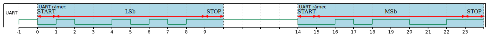
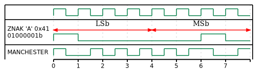
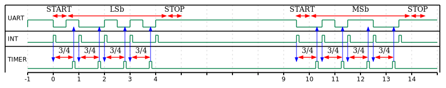
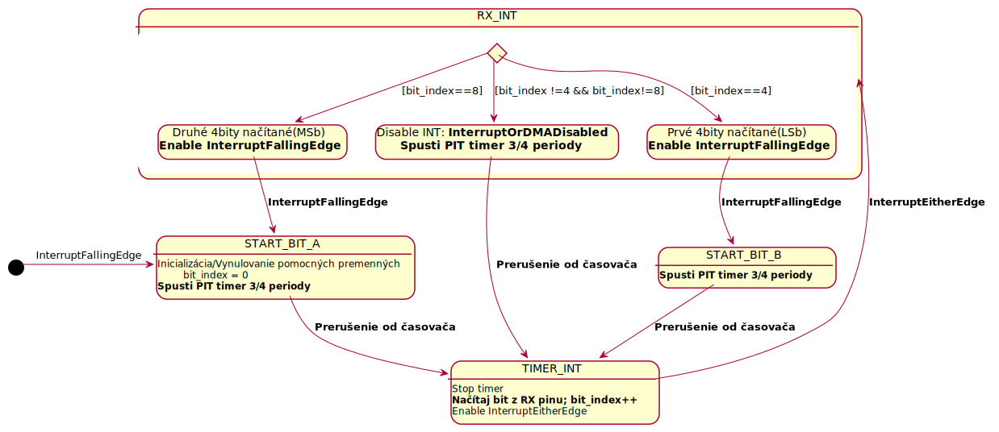

# Dekódovanie manchester kódu odoslaného  pomocu UART asynchronného rozhrania

Dáná úloha sa zaoberá možnosťou ako spracovať a dekódovať  Manchester enkódované dáta odoslané pomocou  UART rozhrania. Na dekodovanie dát na strane MCU je v tomto príklade využitý jeden vstupný pin v režime externého prerušenia. Prerušenie reaguje na zmenu úrovne vstupného signálu. 

### Zapúzdrenie manchester zakódovaného bajtu do UART rámca:

### Príklad kódovanie bajtu do Manchester kódu

### Časový diagram dekódovania dát zakódovaných Manchester kódom zapuzdrených v UART rámcoch

### Stavový diagram 
